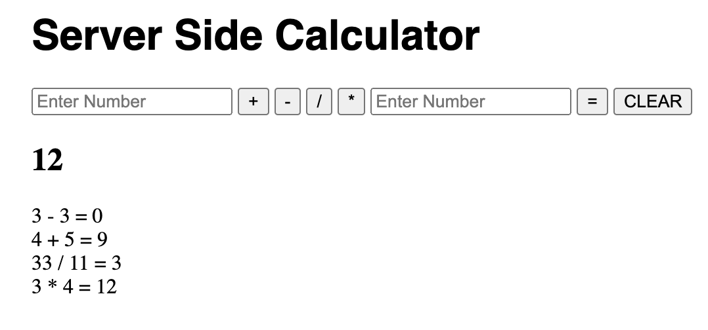

# jQuery Server Side Calculator

## Description

Duration: 20-25 hours

The following application was constructed using Node, Express, JavaScript, jQuery, and the Ajax get, post, and delete methods. Additionally, Postman was used to test the back-end prior to the development of the "client" side of the project. A "styles.css" file and a "bootstrap.css" file are sourced in the "index.html" file; however, for base mode, these aren't necessarily utilized.  

As a calculator, the app allows users to enter two values and choose a binary operation.

### Screen Shot

